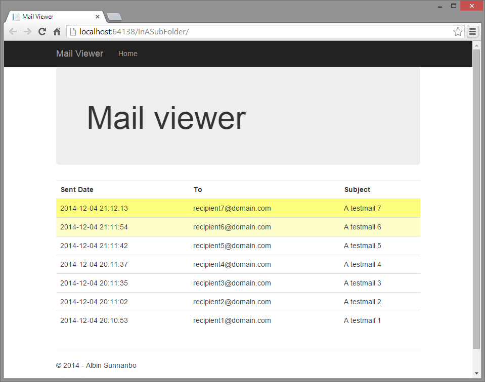
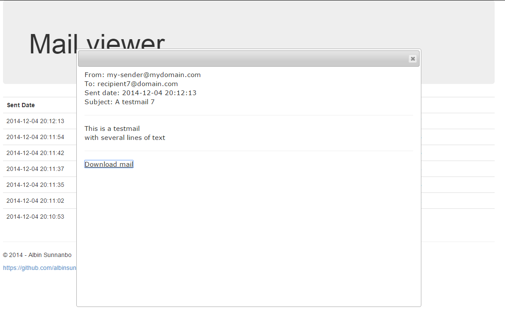

PickupMailViewer
================
The main interface of Pickup Mail Viewer is a list of existing mail.

New mails will be detected and added to the top of the list automatically.  
New mails will be colored yellow, fading when the mail is not new anymore.

Click on a mail line in the list to open the mail content.  
At the bottom of the mail content there is a link for downloading the original eml mail file.
